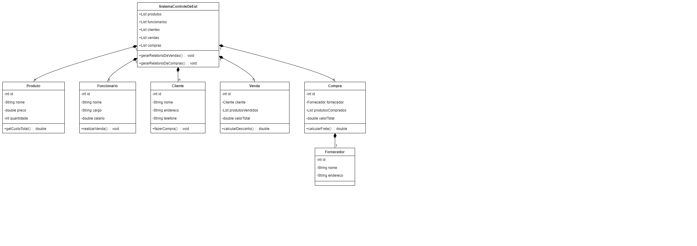

## 1. Definição do Projeto
 Nome do Projeto: *Stockeeper* 

    (PDV offline focado em pequenos negócios)

   

Objetivo: Desenvolver um sistema de ponto de venda (PDV) com foco em logística e geração de relatórios de vendas, utilizando SQLite3 para armazenamento local e QtPy para a interface gráfica.

## 2. Fases do Desenvolvimento
Fase 1: Planejamento
Requisitos Funcionais:

- Gestão de produtos (adicionar, editar, remover, listar)
- Gestão de funcionários
- Gestão de clientes
- Registro de vendas e compras
- Geração de relatórios de vendas e compras
- Interface amigável e intuitiva

Requisitos Não Funcionais:

- Utilização de SQLite3 para armazenamento de dados local
- Interface gráfica responsiva e fluida utilizando QtPy
- Operação offline

Desenho do Sistema:

- Criar diagramas de classes e fluxogramas (já iniciado na imagem anexada)

- Definir a arquitetura de software (MVC - Model-View-Controller)

Fase 2: Desenvolvimento
Ciclos de Desenvolvimento Incrementais:
Primeiro Ciclo:

- Desenvolver a estrutura básica do banco de dados SQLite3
- Implementar a interface básica com QtPy (janelas principais, navegação)
- Criar a gestão de produtos e clientes

Segundo Ciclo:

- Implementar o registro de vendas e compras
- Desenvolver a lógica para cálculo de relatórios
- Ajustar a interface gráfica com base no feedback inicial

Terceiro Ciclo:

- Implementar a geração de relatórios (PDF, CSV)
- Adicionar funcionalidade de backup dos dados
- Refatorar o código para otimização e limpeza

Fase 3: Testes
Testes Unitários:

- Cobrir as principais funcionalidades do sistema
- Verificar a integração entre o banco de dados e a interface gráfica

Testes de Interface:

- Testar a usabilidade da interface
- Identificar possíveis melhorias na experiência do usuário

Testes de Performance:

- Verificar a responsividade da aplicação em diferentes configurações de hardware

Fase 4: Implantação
Empacotamento:

- Criar um instalador para a aplicação
- Documentar o processo de instalação

Treinamento:

- Criar um manual de usuário
- Realizar sessões de treinamento, se necessário

Suporte Pós-Implantação:

- Monitorar a aplicação para correção de bugs
- Implementar melhorias baseadas no feedback dos usuários
## 3. Ferramentas Utilizadas
Desenvolvimento: Python 3.x, QtPy, SQLite3
Controle de Versão: Git (GitHub ou GitLab)
Testes: Pytest, Testes de Interface com QTest
Documentação: Sphinx, Markdown para documentação técnica e de usuário
## 4. Cronograma
Semana 1-2: Planejamento e definição de requisitos
Semana 3-6: Desenvolvimento do primeiro e segundo ciclo
Semana 7-8: Testes e ajustes
Semana 9: Implantação e entrega final
## 5. Feedback e Iteração
Ao final de cada ciclo de desenvolvimento, realizar revisões com stakeholders para ajustar o projeto conforme necessário.
## 6. Considerações Finais
Garantir que o sistema seja modular para facilitar futuras atualizações.
Manter a documentação atualizada em todas as fases do projeto.